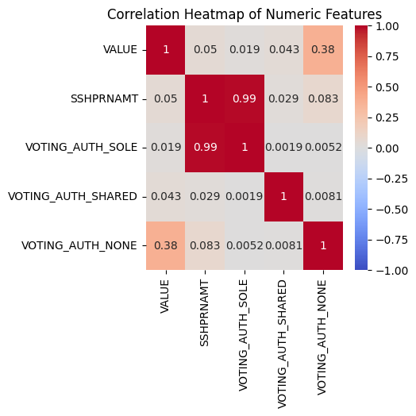
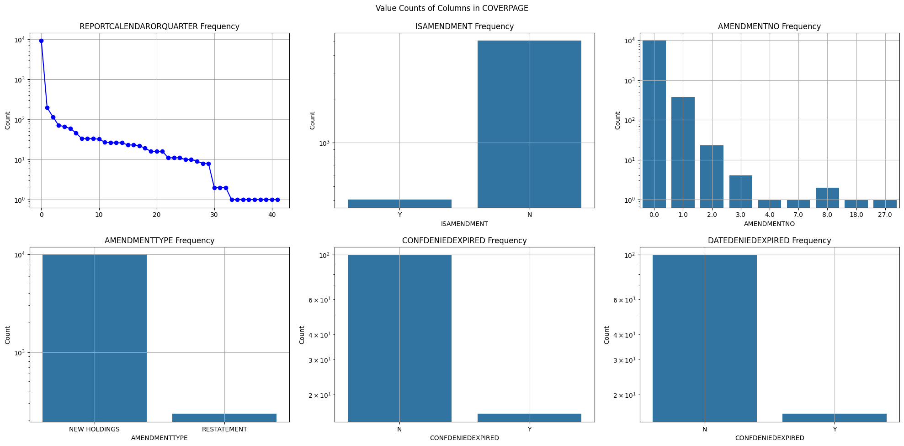
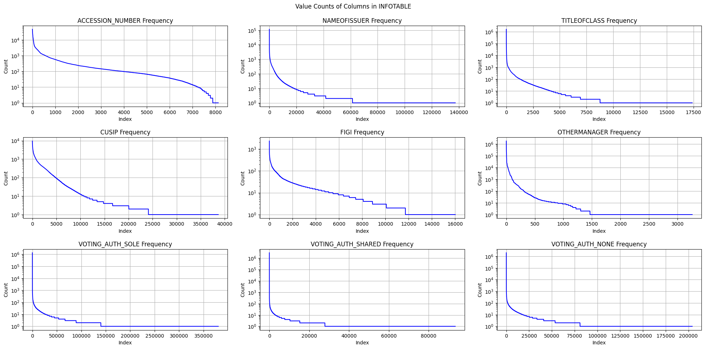
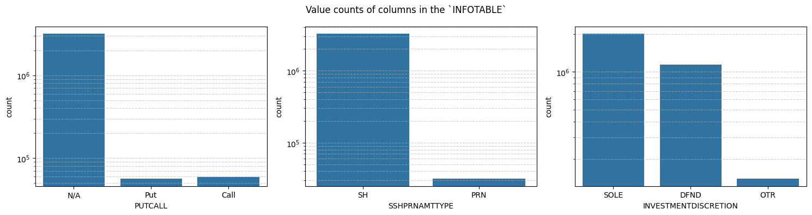
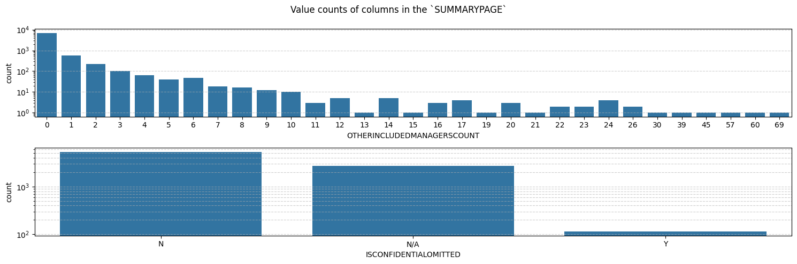

# Milestone 2

**David Bombara, Aditya Saxena, and Nathan Dennis**

Our project involves data from the US Securities and Exchange Commission (SEC) Form 13F.

## 1: Missing Values

    Coverpage has 10117 rows.
    Infotable has 3278515 rows.
    Summary page has 8244 rows.

### `COVERPAGE`

    Number of missing values in each column of the coverpage:
    ACCESSION_NUMBER                    0
    REPORTCALENDARORQUARTER             0
    ISAMENDMENT                      4702
    AMENDMENTNO                      9711
    AMENDMENTTYPE                    9711
    CONFDENIEDEXPIRED               10001
    DATEDENIEDEXPIRED               10101
    DATEREPORTED                    10101
    REASONFORNONCONFIDENTIALITY     10101
    FILINGMANAGER_NAME                  0
    FILINGMANAGER_STREET1               3
    FILINGMANAGER_STREET2            4471
    FILINGMANAGER_CITY                 11
    FILINGMANAGER_STATEORCOUNTRY        3
    FILINGMANAGER_ZIPCODE              21
    REPORTTYPE                          0
    FORM13FFILENUMBER                   0
    CRDNUMBER                        5709
    SECFILENUMBER                    5959
    PROVIDEINFOFORINSTRUCTION5          0
    ADDITIONALINFORMATION            9704
    dtype: int64

Clearly, a large number of columns in the `COVERPAGE` table have missing values. This is not surprising, as not all columns are required to be filled out by the filer. For example, the `AMENDMENTNO` column is only filled out if the `ISAMENDMENT` column is checked. In our data analysis, the only columns that we may use are `ACCESSION_NUMBER`, `REPORTCALENDARORQUARTER`, and `ISAMENDMENT`. Therefore, we can replace missing values in `ISAMENDMENT` with `N` and missing values in `AMENDMENTNO` with `0`.

### `INFOTABLE`

    Number of missing values in each column of the infotable:
    ACCESSION_NUMBER              0
    INFOTABLE_SK                  0
    NAMEOFISSUER                799
    TITLEOFCLASS               1010
    CUSIP                         0
    FIGI                    3018205
    VALUE                         0
    SSHPRNAMT                     0
    SSHPRNAMTTYPE                 0
    PUTCALL                 3162718
    INVESTMENTDISCRETION          0
    OTHERMANAGER            1758980
    VOTING_AUTH_SOLE              0
    VOTING_AUTH_SHARED            0
    VOTING_AUTH_NONE              0
    dtype: int64

The columns `NAMEOFISSUER`, `TITLEOFCLASS`, `FIGI`, `PUTCALL`, and `OTHERMANAGER` have missing values. However, this will not be an issue. Note that `NAMEOFISSUER`, `TITLEOFCLASS`, and `FIGI` can be used to identifier the specific security, but this is unnecessary because the securities can be uniquely identified using the `CUSIP`. 

The `PUTCALL` column has many missing values, but these are easily filled in. If the value is missing, we can assume that the security is neither a put nor a call, but instead owned outright.

`OTHERMANAGER` has missing values, but this is not an issue. This column is only used when the investment discretion is shared with another manager. If the value is missing, then the investment discretion is not shared. 

### `SUMMARYPAGE`

    Number of missing values in each column of the summary page:
    ACCESSION_NUMBER                 0
    OTHERINCLUDEDMANAGERSCOUNT       0
    TABLEENTRYTOTAL                  0
    TABLEVALUETOTAL                  0
    ISCONFIDENTIALOMITTED         2743
    dtype: int64

The only column with missing values is `ISCONFIDENTIALOMITTED`. This column is a boolean column that indicates whether the data is confidential. If the value is missing, we can assume that the data is not confidential.

## Data Imbalance
Below are visualizations of the data imbalances for various columns.

### `COVERPAGE`

    

    

### `INFOTABLE`

For the `VALUE` column, we noted that there are many observations with `0`'s indicating 0 market value. We plan to investigate if these values hold any meaninful insights before we proceed. These observations could harm analysis, as these 0 values could distrupt continuity of time series analysis. However, these observations could provide some context as to the market value of certain stocks for companies and help identify trends for buying and selling behaviors.

We also note that there are several outliers for market value. Some observations have market values over 100 billion, major outliers compared to some of the rest of the companies. These are highly successful companies, such as Microsoft, Nvidia, Amazon, and Apple. We plan to use standardization to scale this variable to mitigate the influence of these larger companies and see how they compare with the rest of our data. This standardization process involves subtracting by the mean and dividing by the standard deviation, putting this variable on the same scale.

There is major data imbalance within some of the categorical variables in our dataset, some classes have far fewer samples than others. To mitigate this issue, we plan to experiment with different strategies, one which is stratified cross-validation to ensure each fold contains the same proportion of a class label across the dataset. This can mitigate the issue of data inbalance favoring the majority class.

To mitigate this imbalance, we plan to test different strategies including resampling or utilizing different algorithms. We plan to experiement using resampling by oversampling the minority class to balance the distribution when conducting analysis.

    

    

    

    

### `SUMMARYPAGE`

    

    

### Potential Resolution for Data Imbalance Issue

Data imbalance can affect the performance of models, especially if the minority class is of particular interest. Below are two potential approaches we may consider to address this challenge before the next milestone:

1. **Stratified Cross-Validation**  
   Stratified cross-validation helps ensure that each fold of the training data has the same distribution of classes as the entire dataset. This approach allows our model to get a balanced representation during training, minimizing bias toward the majority class and improving the model's generalization on unseen data.

2. **Model Sensitivity to Minority Class**  
   By making our model more sensitive to the minority class, we can address the imbalance more effectively. This can be achieved by assigning a higher penalty for incorrect predictions on the minority class. In practice, this often involves adjusting class weights in the loss function, so that the model places more importance on correctly classifying instances from the minority class. This way, we aim to improve the recall of the minority class without significantly compromising overall accuracy.

These techniques can help us handle class imbalance in a way that improves the model's robustness and ensures it performs well on all classes.

### Data Scaling and Its Importance

**Data Scaling** is a critical preprocessing step in improving model performance and avoiding bias in machine learning tasks. In our project, we have features with varying ranges, and without scaling, features with larger scales could disproportionately influence the model. 

Our dataset includes features with varying numeric ranges (e.g., `VALUE`, `SSHPRNAMT`, and `VOTING_AUTH_*` columns). Without scaling, these features with larger values could overshadow features with smaller values, potentially skewing the results. This disparity could also hinder model convergence and reduce the effectiveness of model training.

To address these scaling differences, we have chosen **Standardization** as our primary technique, which centers data by subtracting the mean and dividing by the standard deviation. Standardization is especially suitable for datasets with normally distributed features, helping the model process all features on a comparable scale.

This could result in skewed analysis and inaccurate conclusions. Hence, it is essential to apply scaling techniques such as **Standardization** to bring all numeric features to a comparable scale, which ensures fair weighting across features and enhances interpretability.

In our dataset, we will focus on scaling the following numeric features:
- `VALUE`
- `SSHPRNAMT`
- `VOTING_AUTH_SOLE`
- `VOTING_AUTH_SHARED`
- `VOTING_AUTH_NONE`

We plan to approach scaling differently based on whether we are using **Time Series Cross-Validation** or not.

### Scaling Without Time Series Cross-Validation

Since we currently only have data for one quarter, there is no temporal pattern or chronological dependency to consider. This allows us to perform **Standardization** (Z-score scaling) across the entire dataset for this quarter without introducing bias from future data. Standardization transforms each feature to have a mean of 0 and a standard deviation of 1, making the scale of all features comparable.

          VALUE  SSHPRNAMT  VOTING_AUTH_SOLE  VOTING_AUTH_SHARED  VOTING_AUTH_NONE
    0 -0.025712  -0.010900         -0.008180           -0.029801          -0.02875
    1 -0.025456  -0.010704         -0.007983           -0.029801          -0.02875
    2 -0.025160  -0.010501         -0.007779           -0.029801          -0.02875
    3 -0.025444  -0.010943         -0.008223           -0.029801          -0.02875
    4 -0.025689  -0.010908         -0.008189           -0.029801          -0.02875

### Scaling With Time Series Cross-Validation

As we move to the next milestone, we plan to add multiple quarters over 5+ years to create a comprehensive dataset with chronological data. When using this data for **Time Series Cross-Validation**, we must account for the temporal order to avoid data leakage, where future information might inadvertently influence the past. If we apply a global scaling approach across the whole dataset, it would incorporate information from future quarters, leading to optimistic results and bias.

To avoid this, we will apply **Standardization separately in each fold** of the cross-validation process. By standardizing data independently within each training fold, we ensure that each fold remains isolated from future information, preserving the temporal structure and yielding a more accurate evaluation.

In other words, as we expand to **multiple quarters in the next milestone**, applying global scaling across the dataset would cause **data leakage**, where future data influences past data, resulting in optimistic bias and unreliable evaluations. Instead, we will implement Standardization separately within each fold of the cross-validation process. This approach isolates the training and test data in each fold, ensuring future data does not impact past observations.
